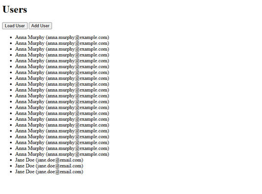
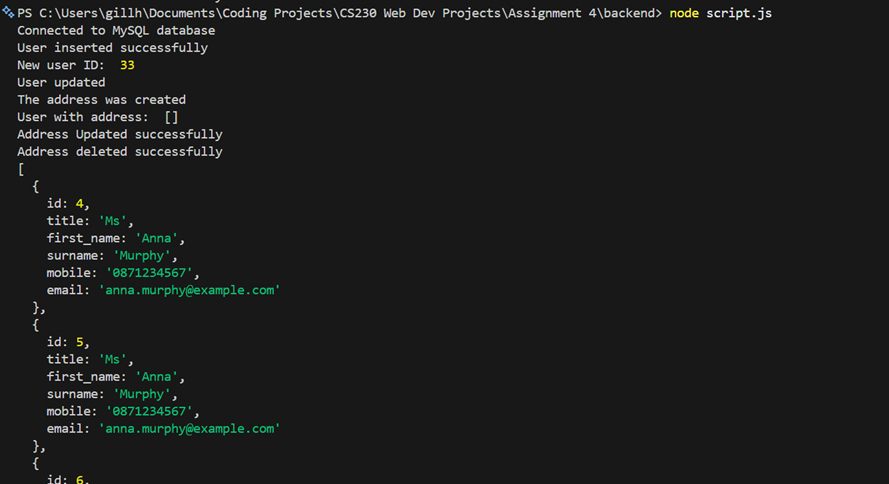

# User Database CRUD

A small full-stack CRUD project for managing user details.

This was a university assignment where the main goal was to connect a backend application to a MySQL database and practise creating, reading, updating, and deleting user data.

The project uses Node.js, MySQL, and a simple HTML/JavaScript frontend.

## Screenshots

  

  

## What I Learned

This project was my first real introduction to working with databases from code rather than just writing SQL queries manually.

One of the biggest things I learned was how a backend application communicates with a database. I used Node.js together with MySQL and learned how to create database connections, send SQL queries from JavaScript, and handle the results that come back from the database.

I also got hands-on experience with CRUD operations, which stands for Create, Read, Update and Delete. Before this project, these concepts were mostly theoretical, but building them myself helped me understand how applications actually store, retrieve, update, and remove information from a database.

This project was also my first experience building a simple backend API. I learned how routes work, how the browser can send a request to the server, and how the server can respond with JSON data.

Overall, this project helped me understand how the frontend, backend, and database connect together in a full-stack application.

## Features

- Connects Node.js to a MySQL database
- Creates new users
- Retrieves users from the database
- Updates user details
- Deletes user/address records
- Uses SQL queries from JavaScript
- Uses a simple backend server
- Uses fetch() on the frontend
- Sends and receives JSON data
- Basic frontend with buttons to load and add users only

## Technologies Used

- JavaScript
- Node.js
- Express
- MySQL
- mysql2
- CORS
- XAMPP / local MySQL server
